# ChatGPT Limit Panel

[English](README.en.md)

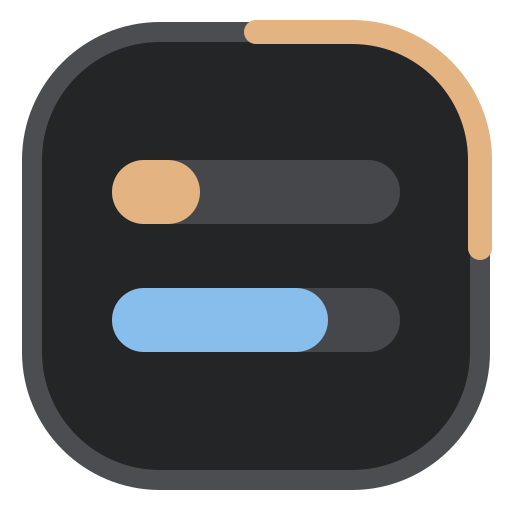

Панель лимитов **Codex / Work** для настольного ChatGPT в Windows. Показывает остаток 5-часового и недельного лимитов, время их сброса, доступные сбросы с датой истечения и остаток кредитов Codex. Три размера панели, светлая и тёмная темы, индикаторы на панели задач и в трее.

**[Скачать для Windows x64](https://github.com/MrBogomoll/chatgpt-limit-panel/releases/latest)** · [Обновление](UPGRADING.md) · [Полное удаление](UNINSTALL.md) · [Все релизы](https://github.com/MrBogomoll/chatgpt-limit-panel/releases)

На странице выпуска скачай готовый ZIP программы из **Assets**. Архивы **Source code** содержат исходники и не предназначены для установки как плагин.

## Возможности

- **Лимиты Codex / Work:** остаток за 5 часов и за неделю, даты и время сброса; обновление примерно раз в 30 секунд. В режиме Instant отображаются те же счётчики.
- **Доступные сбросы:** количество и ближайшее истечение на панели; список всех сбросов с датами и временем в подменю. За 10 дней до истечения блок становится оранжевым, за 3 дня — красным. Просмотр не расходует сбросы.
- **Кредиты Codex:** отдельный остаток между сбросами и лимитами. Сбросы и кредиты включаются независимо. Денежный баланс API текущий источник не предоставляет.
- **Три размера:** полный, компактный и ультракомпактный; ЛКМ переключает виды, ПКМ открывает настройки. При нехватке места панель автоматически уменьшается.
- **Полоски и контур:** можно выбрать сочетание индикаторов и лимит для контура. При остатке ≤30% используется оранжевый, при ≤10% — красный. В ультракомпакте обе полоски остаются всегда; устаревшие данные бледнеют.
- **Расположение:** закрепление на боковой полосе или свободное перетаскивание внутри ChatGPT. Положение сохраняется и сбрасывается через меню.
- **Панель задач и трей:** перетаскиваемый индикатор с процентами и отдельно включаемая живая иконка с двумя лимитами.
- **Оформление:** тёмная, светлая и автоматическая темы, русский и английский языки, независимая непрозрачность фона панели и индикатора на панели задач. Настройки сохраняются.

## Как выглядит

Сбросы и кредиты можно включать независимо через **ПКМ → Содержимое панели**. Ниже — отдельные изображения с демонстрационными данными.

### Полный вид

| Индикатор | Только лимиты | Со сбросами | С кредитами | Всё вместе |
| :--- | :---: | :---: | :---: | :---: |
| Полоски и контур | 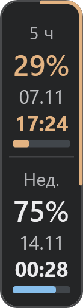 | 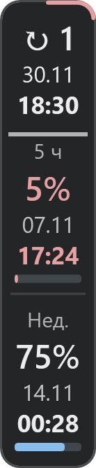 | 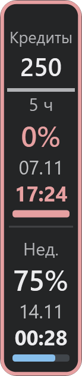 | 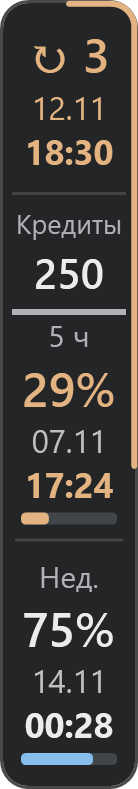 |
| Только контур | 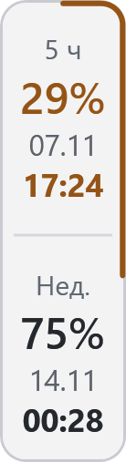 | 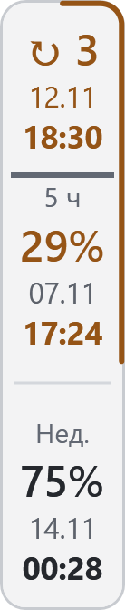 | 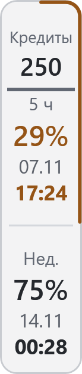 | 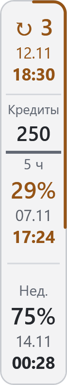 |

### Компактный вид

| Индикатор | Только лимиты | Со сбросами | С кредитами | Всё вместе |
| :--- | :---: | :---: | :---: | :---: |
| Полоски и контур | 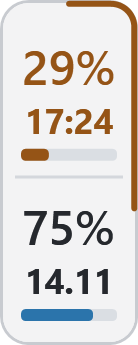 | 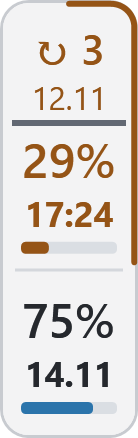 | 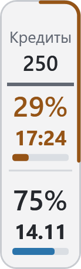 | 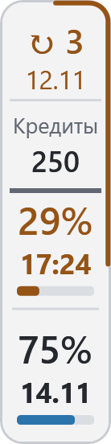 |
| Только контур | 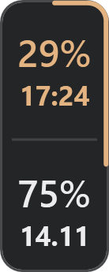 | 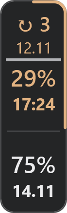 | 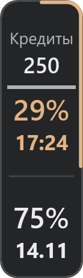 | 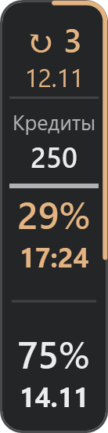 |

### Ультракомпактный вид

Две полоски отображаются всегда; дополнительные блоки показывают только количество сбросов и остаток кредитов.

| Только лимиты | Со сбросами | С кредитами | Всё вместе |
| :---: | :---: | :---: | :---: |
| 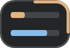 | 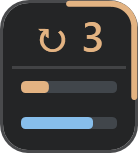 | 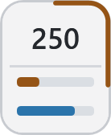 | 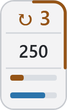 |

### Рядом с чатом

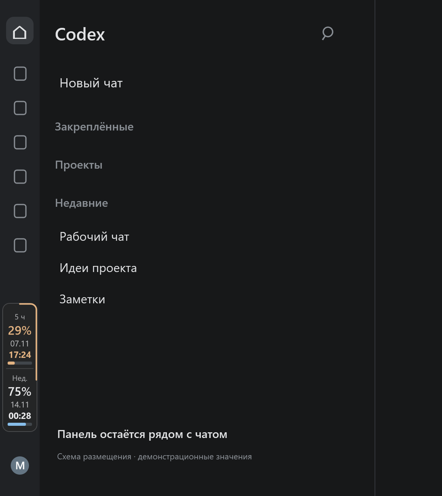 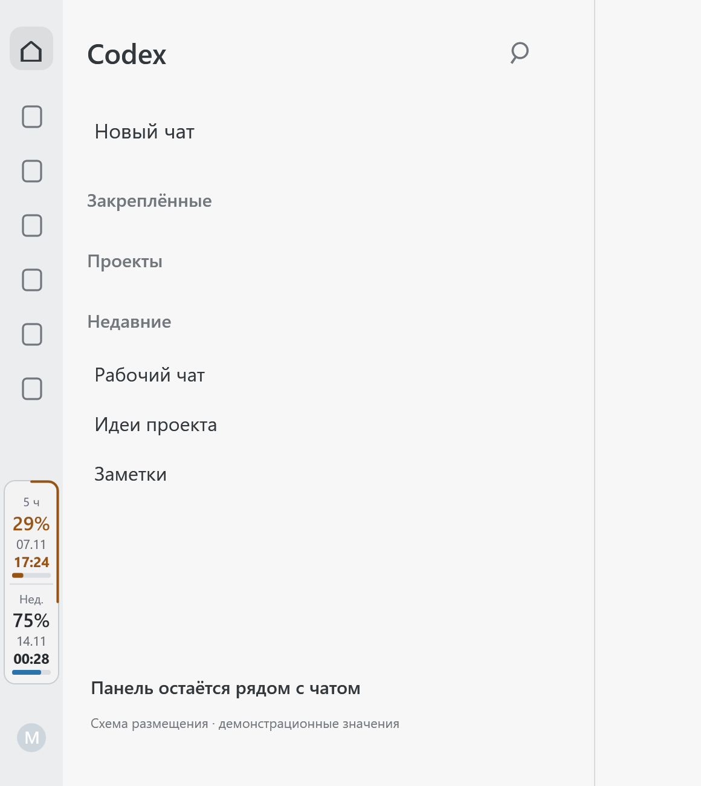

### На панели задач Windows

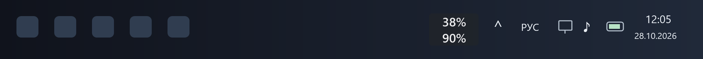

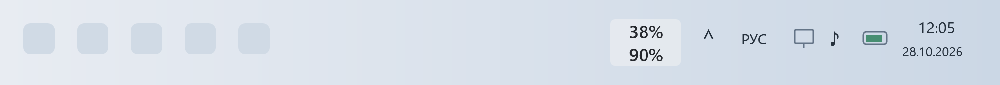

Сами панели отрисованы из компонентов программы. Значения демонстрационные; окружение чата и панели задач показано схематично. Это иллюстрации размещения, а не снимки рабочего стола.

## Установка

Нужны Windows x64, настольный клиент ChatGPT с поддержкой локальных плагинов и установленный Codex со входом в нужный аккаунт. Отдельные API-ключ, Git и Node.js не требуются.

1. Скачай готовый ZIP по ссылке выше.
2. Открой **Плагины → Добавить → Загрузить архив плагина** и выбери ZIP.
3. Открой [карточку управления](#как-открыть-карточку-управления).
4. Нажми **«Запустить»**.

При первом запуске создаётся пользовательская задача автозапуска Windows; её можно отключить в меню панели. Чтобы включить индикатор панели задач, нажми **ПКМ по панели → Расположение → Панель задач → Показывать проценты**. Живая иконка включается через **ПКМ по значку в трее → Расположение → Живая иконка в трее**.

При включённом индикаторе панели задач **или** живой иконке монитор может обновлять лимиты без открытого окна ChatGPT. Закрытие карточки управления не останавливает монитор; для остановки выбери **«Остановить панель»**.

## Как открыть карточку управления

Карточка — это ответ плагина в чате с кнопками **«Запустить»**, **«Остановить»** и **«Обновить состояние»**.

1. Открой новый чат в настольном приложении, где установлен плагин.
2. В поле сообщения введи **@**, начни писать **ChatGPT Limit Panel** и выбери его в разделе **«Плагины»**.
3. Отправь: **«Открой управление панелью лимитов Codex/Work»**. В ответе появится карточка управления.

Если плагина нет в списке, проверь его установку и включение в **«Плагины»**. После обновления открой новый чат, чтобы он получил новые инструменты. Выбор через @ описан в [документации OpenAI](https://learn.chatgpt.com/docs/build-plugins).

## Обновление и удаление

Удаление с версии 1.7.7: **карточка плагина → Настройки плагина → Удалить плагин…**, затем подтверждение в отдельном окне. Настройки можно сохранить.

**«Проверить новую версию»** проверяет стабильный выпуск и предлагает открыть его страницу. ZIP устанавливается вручную. Инструкции: [обновление](UPGRADING.md) · [полное удаление](UNINSTALL.md). История изменений находится в [CHANGELOG](CHANGELOG.md) и [релизах](https://github.com/MrBogomoll/chatgpt-limit-panel/releases).

## Совместимость и данные

Панель проверена на Windows 11, включая Start11 и расположение рядом с NetWorx. Совместимость с Windows 10 пока не подтверждена. Если загрузка ZIP недоступна или возникла ошибка, укажи версию Windows, клиента и описание в [Issues](https://github.com/MrBogomoll/chatgpt-limit-panel/issues).

Панель запускает локальный Codex App Server и запрашивает у него лимиты текущего аккаунта. Настройки и состояние сохраняются локально в `%LOCALAPPDATA%\ChatGPTLimitPanel` (при наличии старых данных может использоваться `ChatGPTQuotaOverlay`); при проверке обновлений программа обращается к GitHub API. Программа использует текущий локальный вход Codex. Авторизация и настройки пользователя не входят в архив. Проект независимый и не является официальным продуктом OpenAI. [Контрольная сумма ZIP 1.7.7](https://github.com/MrBogomoll/chatgpt-limit-panel/releases/download/v1.7.7/chatgpt-limit-panel-1.7.7-windows-x64.zip.sha256).

Сообщение об уязвимостях: [политика безопасности](SECURITY.md).

## Лицензия

Исходный код проекта распространяется по [лицензии MIT](LICENSE). Node.js, включённый в готовую сборку, имеет [отдельную лицензию](third-party/NODE-LICENSE.txt).

## Разработка

В репозитории находятся исходники, тесты и инструменты сборки. Подробнее: [сборка и проверки](docs/BUILDING.md), [архитектура](docs/ARCHITECTURE.md), [участие в разработке](CONTRIBUTING.md).
